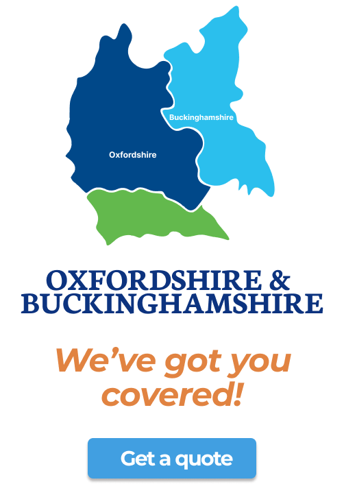
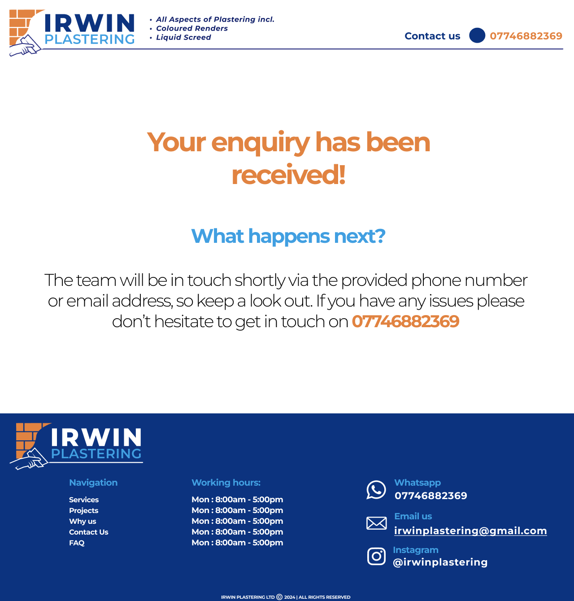

# Irwin Plastering — Website Design & Development

**Independent Client Project | Completed April 2025**

**Tech Stack:** Next.js 15 · React 19 · TypeScript · Tailwind CSS · shadcn/ui · Zod · React Hook Form · EmailJS · Vercel · Figma

# Irwin Plastering — Website Design & Development

**Independent Client Project | April 2025**

**Role:** Sole Designer & Developer  
**Stack:** Next.js 15 · React 19 · TypeScript · Tailwind CSS · Zod · React Hook Form · EmailJS · Vercel  
**Design:** Figma · Responsive UI · Wireframing · Brand Development  
**Status:** Completed — Original domain currently inactive

## Project Overview

Designed, developed and deployed a responsive website for an independent plastering business, taking ownership of the project from initial discovery through to technical handover.

Working from a single physical advertisement and a limited Instagram presence, I established the website's visual direction, created wireframes and responsive designs, and translated ambiguous requirements into a functional web experience.

I independently handled frontend development, form validation, customer enquiry integration, technical SEO, deployment and documentation.

The project was designed around the client's limited budget, prioritising maintainability, performance and avoiding unnecessary backend infrastructure.

### Key Contributions

- **End-to-end ownership:** Managed discovery, design, development, deployment and handover.
- **UI/UX design:** Created logo concepts, wireframes and responsive layouts in Figma.
- **Frontend engineering:** Built the website using Next.js, React and TypeScript.
- **Form integration:** Implemented Zod validation, React Hook Form and EmailJS.
- **Technical SEO:** Configured sitemap generation, robots.txt and SEO fundamentals.
- **Infrastructure:** Configured Vercel deployment and domain DNS.
- **Stakeholder management:** Translated unclear requirements into approved designs through iterative feedback.

---

## The Challenge

The project began without a detailed technical brief, established website or comprehensive brand guidelines.

I needed to establish the website's structure, visual direction and content while working with a non-technical stakeholder. The design approval process extended over several months, requiring multiple iterations and clear communication of design decisions.

The client also had a limited budget, making ongoing running costs and maintainability important considerations.

### The Starting Point

The client's existing physical advertisement was the primary visual reference for the project. I used it to inform the website's branding, colour palette and overall design direction.

## Discovery & Design

I used Figma to explore logo ideas, develop wireframes and design responsive desktop and mobile layouts.

My responsibilities included:
- Translating the client's existing advertisement into a consistent website identity.
- Planning page structure, content hierarchy and customer enquiry journeys.
- Creating desktop and mobile designs.
- Presenting design concepts and incorporating stakeholder feedback.
- Designing a contact form and post-submission confirmation experience.

### Responsive Website Design

I designed the website in Figma, creating layouts for desktop and mobile devices. My approach focused on maintaining a consistent visual identity while adapting navigation, content hierarchy and service information for smaller screens.

#### Desktop Homepage

#### Mobile Homepage

### Visual Identity Exploration

I explored logo concepts and supporting visual elements to translate the client's existing branding into a consistent digital experience.

## Customer Enquiry Experience

I designed a customer enquiry journey to make it straightforward for prospective customers to request a quote or ask about the company's services.

The form collects relevant information, including contact details, building type, postcode, required services and a description of the work.

I also designed a confirmation screen to communicate that the enquiry had been received and explain what customers should expect next.

### Desktop Contact Form

### Mobile Contact Form

### Enquiry Confirmation

### Mobile Confirmation

## Engineering & Architecture

### Next.js and React
I selected Next.js for its support for static generation, SEO metadata and image optimisation. Its React-based architecture also supported reusable UI components.

### TypeScript
I used TypeScript throughout the project to improve type safety, catch errors earlier and make the codebase more maintainable. The project also provided an opportunity to strengthen my practical TypeScript experience.

### Forms: Zod, React Hook Form and EmailJS
I used Zod for schema-based input validation and React Hook Form for form state and error handling.

EmailJS handled customer enquiries and automated confirmation emails without requiring a dedicated backend email service.

### Cost-Conscious Architecture
The website did not require a database or custom server-side application logic, so I took a static-first approach to avoid unnecessary infrastructure.

I used Vercel for hosting and GitHub-connected deployment, with the domain managed through GoDaddy. The goal was to minimise maintenance and recurring costs while keeping the solution straightforward for the client.

### SEO
I planned an SEO-friendly site structure and configured technical SEO fundamentals, including sitemap and robots.txt generation using next-sitemap.

## Deployment & Handover

I configured the hosting and deployment workflow and produced technical documentation covering local development, project structure, form configuration, deployment and ongoing maintenance.

## What I Learned

This project strengthened my ability to manage the full delivery lifecycle rather than focusing only on implementation.

The biggest challenge was translating ambiguous business requirements into a clear, achievable technical solution. It required stakeholder communication, independent decision-making, iterative design and balancing technical choices against the client's budget.

## Project Availability

The original website is currently offline following the lapse of its domain registration.

This repository documents the design and development process. The original source repository remains private.

---

**Design & Development:** Oscar Oneim  
**Project Handover:** April 2025
